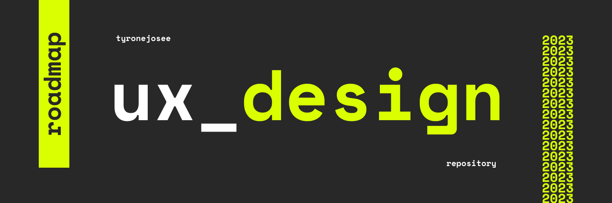

# Roadmap: UX Design

## ¿Qué es el Diseño UX?

El diseño UX (User Experience) o Experiencia de Usuario, es un conjunto de procesos, técnicas, métodos y metodologías con los cuales desarrollamos productos, ya sean digitales o físicos. El objetivo es crear experiencias significativas, relevantes y placenteras para los usuarios.

En cada momento de nuestras vidas, experimentamos reacciones y emociones, y es precisamente en ese punto donde entra en juego un diseñador UX. Su rol es diseñar y gestionar cada una de las interacciones que los usuarios tienen con nuestros productos. El diseñador UX se esfuerza por entender las necesidades y comportamientos de los usuarios para ofrecerles una experiencia satisfactoria y agradable en su interacción con el producto.

El mundo del diseño de experiencias no es tan sencillo como parece, ya que quienes reaccionan y experimentan emociones son las personas, seres humanos. Es precisamente ahí donde todo se complica; los seres humanos somos una especie compleja, con motivaciones, sentimientos, entornos, patrones de conducta y una serie de complejidades que nos conforman.

Para obtener un sólido entendimiento de estos conceptos, te invito a explorar detenidamente la lista disponible en . Ten presente que esta información es solo un punto de partida, por lo que es crucial que sigas investigando para adquirir un conocimiento más profundo y aplicable en diversas situaciones.

## Recomendaciones

Este repositorio tiene como objetivo proporcionar información clara de diversas fuentes y facilitar el acceso a personas hispanohablantes mediante su traducción al español. Está diseñado tanto como un recurso personal como para el beneficio de cualquier persona que lo necesite. Recuerda que el saber compartido perdura, así que si encuentras útil este repositorio, te invitamos a contribuir y ayudar a expandir su contenido.

- La estructura del repositorio está organizada de manera intuitiva y jerárquica para una navegación sencilla.
- Se han utilizado etiquetas y categorías para clasificar los recursos y mejorar la experiencia de búsqueda.
- Encontrarás enlaces a recursos adicionales, que complementarán tu conocimiento.

### Referencias

La información presente en este repositorio proviene de las siguientes fuentes.

- [Roadmap.sh](https://roadmap.sh/)
- [YouTube.com](https://www.youtube.com/)
